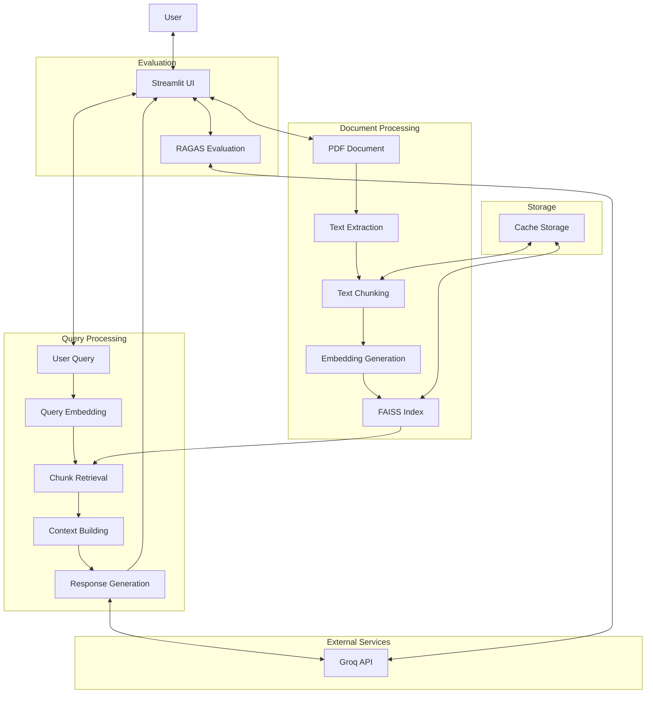
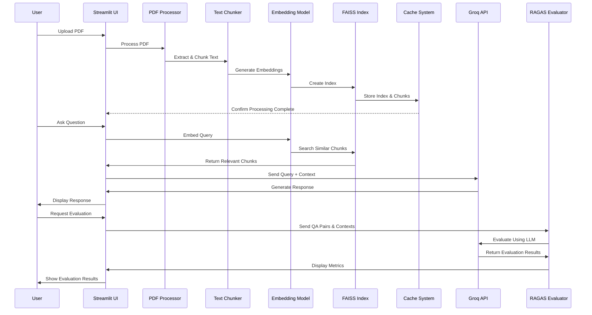

# PDF Chatbot System Architecture

## Overview

The PDF Chatbot is a Retrieval-Augmented Generation (RAG) system that enables users to have interactive conversations with PDF documents. The application allows users to upload PDF files, process them, and ask questions about their content. The system retrieves relevant information from the document and generates natural language responses using the Groq API.

## System Architecture Diagrams

### High-Level Architecture

### Data Flow Diagram

## System Components

The system consists of several key components that work together to provide the PDF chatbot functionality:

### 1. User Interface (Streamlit)

- **Main Application (`app.py`)**: Provides a web-based interface using Streamlit where users can:
  - Upload PDF documents
  - View the uploaded PDF
  - Ask questions about the document
  - View chat history
  - Configure system settings
  - Run evaluations on the RAG system

### 2. Document Processing Pipeline

- **Text Extraction (`utils.py`)**:

  - Extracts text content from uploaded PDF files using PyMuPDF (fitz)
  - Generates a unique hash for each document to enable caching

- **Text Chunking (`utils.py`)**:
  - Splits extracted text into manageable chunks with overlap
  - Uses NLTK for sentence tokenization to maintain context
  - Configurable chunk size and overlap parameters

### 3. Vector Database and Retrieval System

- **Embedding Generation (`embedding.py`)**:

  - Creates vector embeddings for text chunks using Sentence Transformers
  - Uses the "all-MiniLM-L6-v2" model for generating embeddings
  - Includes an adapter class for compatibility with RAGAS evaluation framework

- **FAISS Index (`embedding.py`)**:

  - Creates and manages a FAISS index for efficient similarity search
  - Enables fast retrieval of relevant document chunks based on query similarity
  - Supports configurable number of chunks to retrieve (top-k)

- **Caching System (`utils.py`)**:
  - Saves processed chunks, embeddings, and FAISS indices to disk
  - Loads cached data when the same document is re-uploaded
  - Improves performance by avoiding redundant processing

### 4. Language Model Integration

- **Response Generation (`ollama.py`)**:
  - Integrates with Groq API to generate natural language responses
  - Supports different prompting approaches (zero-shot and few-shot)
  - Constructs prompts that include relevant document chunks as context
  - Uses the meta-llama/llama-4-scout-17b-16e-instruct model

### 5. Evaluation Framework

- **RAGAS Evaluation (`ragas_eval.py`)**:
  - Implements evaluation metrics for the RAG system using the RAGAS framework
  - Supports metrics like Faithfulness, AnswerRelevancy, context_precision, and context_recall
  - Enables generation of test datasets for comprehensive evaluation
  - Provides detailed evaluation results for system assessment

### 6. Utility Components

- **Streamlit Patch (`streamlit_patch.py`)**:
  - Fixes compatibility issues between Streamlit and PyTorch
  - Patches Streamlit's local_sources_watcher to handle PyTorch's custom classes

## Data Flow

The system follows this general data flow:

1. **Document Upload and Processing**:

   - User uploads a PDF document through the Streamlit interface
   - System extracts text from the PDF using PyMuPDF
   - Text is split into chunks with overlap using NLTK
   - Chunks are embedded using Sentence Transformers
   - Embeddings are indexed in a FAISS database
   - Processed data is cached for future use

2. **Query Processing**:

   - User submits a question through the chat interface
   - Question is embedded using the same embedding model
   - FAISS index is searched to find the most similar chunks
   - Top-k relevant chunks are retrieved based on similarity

3. **Response Generation**:

   - Retrieved chunks are combined into a context
   - A prompt is constructed with the question and context
   - Prompt is sent to the Groq API with the selected model
   - Generated response is displayed to the user in the chat interface

4. **Evaluation (Optional)**:
   - User can trigger RAGAS evaluation on the chat history
   - System extracts question-answer pairs and relevant contexts
   - RAGAS metrics are calculated using the Groq API
   - Evaluation results are displayed to the user

## Technology Stack

### Core Technologies

- **Python**: Primary programming language
- **Streamlit**: Web application framework for the user interface
- **PyMuPDF (fitz)**: Library for PDF processing and text extraction
- **NLTK**: Natural Language Toolkit for text processing and tokenization
- **Sentence Transformers**: Framework for generating text embeddings
- **FAISS**: Vector database for efficient similarity search
- **Groq API**: Language model API for generating responses
- **RAGAS**: Framework for evaluating RAG systems

### Deployment Technologies

- **Docker**: Containerization for consistent deployment
- **Docker Compose**: Multi-container application orchestration

## Deployment Architecture

The application is containerized using Docker, which provides several benefits:

- **Consistency**: Ensures the application runs the same way in all environments
- **Isolation**: Packages all dependencies within the container
- **Portability**: Simplifies deployment across different platforms
- **Scalability**: Facilitates scaling the application as needed

The Docker setup includes:

- **Dockerfile**: Defines the container image with all necessary dependencies
- **docker-compose.yml**: Configures the application service, networking, and volumes
- **Volume Mounting**: Persists processed data (FAISS indices and chunks) across container restarts

## Security Considerations

- **API Keys**: Groq API key is managed through environment variables
- **Data Handling**: All processing happens locally within the container
- **No External Data Storage**: Document data remains within the application and is not sent to external services except for the specific queries to the Groq API

## Performance Optimization

- **Caching**: Processed documents are cached to avoid redundant processing
- **Efficient Retrieval**: FAISS enables fast similarity search for large document collections
- **Configurable Parameters**: Users can adjust the number of chunks to retrieve to balance between context completeness and response time

## Limitations and Constraints

- **Document Size**: Very large PDFs may require significant processing time and memory
- **Language Support**: Performance may vary for non-English documents
- **Model Limitations**: Response quality depends on the capabilities of the Groq API and the selected model
- **API Dependency**: Requires an active internet connection and valid Groq API key for response generation

## Future Expansion Possibilities

- **Multi-document Support**: Enable chatting with multiple documents simultaneously
- **Additional File Formats**: Extend support to other document formats beyond PDF
- **Advanced Retrieval Methods**: Implement more sophisticated retrieval techniques
- **Custom Models**: Support for locally hosted language models
- **User Authentication**: Add user accounts and document management
- **Collaborative Features**: Enable sharing and collaborative document analysis
